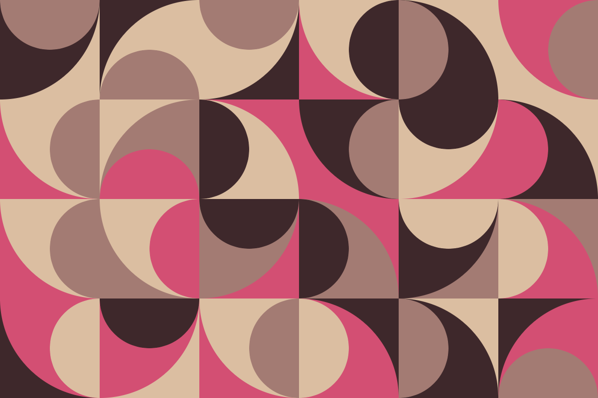

This mini project was done in order to see how shapes can be used in a grid-like pattern to generate a piece of art. This project allowed me to better understand how to call functions, create and manipulate arrays, and use randomness in a controlled way.

Some results that I can share are below:

